<div align="center">
NOt this note bokk run  under 7hrs 


<br/>

[](https://www.kaggle.com/code/malikgt5/qwen3-8b-coding-fine-tune-opencodeinstruct-qlo)
[](https://huggingface.co/Maliktg7/qwen3-8b-opencodeinstruct-merged)
[](https://huggingface.co/Maliktg7/qwen3-8b-opencodeinstruct-checkpoints)
[](LICENSE)


</div>

<br/>

## 🧭 Table of Contents

- [🎯 What This Is](#-what-this-is)
- [🏗️ Pipeline Architecture](#️-pipeline-architecture)
- [🧠 Key Decisions & Why](#-key-decisions--why)
- [📊 Results](#-results)
- [🐛 The Bug That Nearly Killed the Run](#-the-bug-that-nearly-killed-the-run)
- [🎮 Live Demo](#-live-demo)
- [🛠️ Tech Stack](#️-tech-stack)
- [📁 Repo Structure](#-repo-structure)
- [🚀 How to Reproduce](#-how-to-reproduce)
- [🗺️ Roadmap](#️-roadmap)
- [📜 License & Credits](#-license--credits)

<br/>

## 🎯 What This Is


**Qwen3-8B**, fine-tuned into a coding specialist using **QLoRA + SFT** on a filtered slice of **NVIDIA's OpenCodeInstruct** dataset, trained end-to-end on **2× Tesla T4 GPUs (Kaggle, free tier)** with real PyTorch **DDP** via `torchrun`.

It was benchmarked against its own untouched base model on **HumanEval+** and **MBPP+**, and the LoRA adapter + a merged fp16 model were both published to Hugging Face — plus a live Gradio demo to poke at it.

> 🔗 **Notebook:** [Kaggle — qwen3-8b-coding-fine-tune-opencodeinstruct-qlo](https://www.kaggle.com/code/malikgt5/qwen3-8b-coding-fine-tune-opencodeinstruct-qlo)
> 🔗 **This repo:** [Fine_tune_qwen3-8b-opencodeinstruct-finetune](https://github.com/mudassar2224/Fine_tune_qwen3-8b-opencodeinstruct-finetune)

<br clear="right"/>

## 🏗️ Pipeline Architecture

```mermaid
flowchart LR
    A["🧊 Qwen3-8B-Instruct<br/>4-bit (Unsloth)"] --> B["📚 OpenCodeInstruct<br/>(streamed, not downloaded)"]
    B --> C["🧹 Quality filter<br/>avg_test_score ≥ 0.8"]
    C --> D["🔁 Exact-hash dedup"]
    D --> E["✂️ Length filter<br/>≤2048 tokens"]
    E --> F["🎯 QLoRA r=16 α=32<br/>SFT via TRL"]
    F --> G["⚡ DDP · torchrun<br/>2× Tesla T4"]
    G --> H["💾 Checkpoint every 200 steps<br/>→ pushed to 🤗 Hub"]
    H --> I{"More sessions<br/>needed?"}
    I -- yes --> G
    I -- no --> J["🧬 Merge to fp16<br/>save_pretrained_merged"]
    J --> K["🚀 Published to<br/>🤗 Hugging Face"]
    K --> L["🎨 Gradio demo"]

    style A fill:#6366f1,color:#fff
    style F fill:#a855f7,color:#fff
    style G fill:#ec4899,color:#fff
    style K fill:#f59e0b,color:#fff
    style L fill:#10b981,color:#fff
```



<br/>

## 🧠 Key Decisions & Why

<details open>
<summary><b>🟢 Click to expand — the choices that shaped this project</b></summary>

<br/>

| Decision | Why |
|---|---|
| 🎯 **OpenCodeInstruct only, no rStar-Coder mix** | Already a complete, test-verified 5M-example coding SFT set — one dataset keeps the pipeline simple and fast to ship |
| 🌊 **Streaming, not full download** | Avoids materializing 5M rows on Kaggle's disk before training even starts |
| 🧮 **Exact-hash dedup, bounded to retained rows** | Cheap by construction — the hash set only grows to the *final* dataset size, not the raw 5M |
| 🖥️ **Real DDP via `torchrun`, not a toy single-GPU run** | Unsloth's own docs demonstrate this exact pattern with Qwen3-8B — a real, documented, working setup |
| 📦 **Materialized `Dataset`, not a live `IterableDataset`** | Sidesteps a real upstream Unsloth bug — [see below](#-the-bug-that-nearly-killed-the-run) |
| 🧬 **fp16 merge via `save_pretrained_merged`** | The standard, documented Unsloth path — dequantizes properly instead of merging into 4-bit weights directly |
| 🧊 **`enable_thinking=False` for eval** | Qwen3 defaults to "thinking mode," and Qwen's own docs warn greedy decoding + thinking mode causes degraded, repetitive output |

</details>

<br/>

## 📊 Results

<div align="center">

### pass@1, base Qwen3-8B-Instruct vs. fine-tuned (500 steps / 0.8 epochs)

| Benchmark | 🧊 Base | 🔥 Fine-tuned | Δ |
|:---:|:---:|:---:|:---:|
| **HumanEval** | 0.860 | 0.841 | 🔻 −0.019 |
| **HumanEval+** | 0.799 | 0.756 | 🔻 −0.043 |
| **MBPP** | 0.780 | 0.796 | 🟢 +0.016 |
| **MBPP+** | 0.680 | 0.680 | ➖ 0.000 |

</div>

> ⚠️ **Honest take:** this run is **undertrained**, not a finished result — the log shows `epoch: 0.8`, meaning less than one full pass over the 20K-example training set, with loss still dropping fast (0.74 → ~0.19) when the 500-step session ended. The dip on HumanEval+ tracks with that: a short run nudges style toward the fine-tuning data before enough training brings broad coding skill back up. Measured throughput was **~24.6s/step**, so a full 12-hour Kaggle session buys ~1,750 more steps — the next run targets `--max_steps 3000+` to get several real epochs in before calling this "improved."

### Manual spot-check (temperature 0.6, Gradio demo)

| Prompt | Rating | Notes |
|---|:---:|---|
| LRU Cache (`OrderedDict`) | 🟩🟩🟩🟩🟩🟩🟩🟩🟩⬜ 9/10 | Correct, real O(1), clean docs |
| Sliding window max (`deque`) | 🟩🟩🟩🟩🟩🟩🟩🟩🟩⬜ 9/10 | Correct monotonic-deque pattern |
| Async task processor (`Semaphore`) | 🟨🟨🟨🟨⬜⬜⬜⬜⬜⬜ 4/10 | Missing import (`Awaitable`), doesn't actually rate-limit |
| Thread-safe bounded queue (`Condition`) | 🟨🟨🟨🟨🟨⬜⬜⬜⬜⬜ 5/10 | Correct concurrency logic, missing `Any` import |

**Pattern:** strong on single-concept problems, wobbles once a prompt needs imports + control flow + concurrency semantics all correct together — consistent with an undertrained checkpoint.

<br/>

## 🐛 The Bug That Nearly Killed the Run

<details>
<summary><b>🔴 Click to expand — a real upstream Unsloth regression, found and fixed</b></summary>

<br/>

Training first failed with:
```
NameError: name '_iterable_batch_size' is not defined
```
inside Unsloth's auto-generated `UnslothSFTTrainer.py`. Cross-checking against Unsloth's GitHub history confirmed it: older versions read `dataset._ex_iterable.batch_size` directly; this build refactored that into a helper function, `_iterable_batch_size(dataset)`, but shipped without the function's definition. It only fires when `train_dataset` is a live `IterableDataset`.

Two attempts to monkey-patch Unsloth's generated cache file failed, because that file is regenerated by Unsloth itself during `SFTTrainer(...)` init — anything written to it beforehand either doesn't exist yet to patch, or gets overwritten.

**The actual fix:** stop handing `SFTTrainer` an `IterableDataset` at all. The training script streams through OpenCodeInstruct lazily but collects a bounded number of qualifying rows into a real, materialized `datasets.Dataset` before training starts — a completely different, non-buggy code path.

</details>

<br/>

## 🎮 Live Demo

A Gradio Studio interface with persona presets, temperature/top-p controls, and example prompts — running the merged fp16 model, single-GPU inference.

```python
model, tokenizer = FastLanguageModel.from_pretrained(
    model_name="Maliktg7/qwen3-8b-opencodeinstruct-merged",
    load_in_4bit=True,
)
```

<br/>

## 🛠️ Tech Stack

<div align="center">


</div>

| Component | Choice |
|---|---|
| Base model | `unsloth/Qwen3-8B-unsloth-bnb-4bit` |
| Method | QLoRA (r=16, α=32) + SFT |
| Dataset | `nvidia/OpenCodeInstruct`, filtered `avg_test_score ≥ 0.8`, deduplicated |
| Hardware | 2× NVIDIA Tesla T4 (Kaggle, free tier) |
| Parallelism | PyTorch DDP via `torchrun --nproc_per_node=2` |
| Sequence length | 2048 |
| Evaluation | EvalPlus — HumanEval+, MBPP+ |
| Demo | Gradio Blocks, single-GPU inference |

<br/>

## 📁 Repo Structure

```
📦 Fine_tune_qwen3-8b-opencodeinstruct-finetune
 ┣ 📜 train.py                 # Standalone QLoRA/SFT script, launched via torchrun
 ┣ 📓 notebook.ipynb           # Full Kaggle notebook (baseline → train → eval → publish)
 ┣ 🎨 app.py                   # Gradio demo (loads the merged model)
 ┗ 📘 README.md                # You are here
```

<br/>

## 🚀 How to Reproduce

1. Open the [Kaggle notebook](https://www.kaggle.com/code/malikgt5/qwen3-8b-coding-fine-tune-opencodeinstruct-qlo) and fork it
2. Settings → Accelerator → **GPU T4 x2**, Internet → **On**
3. Add a Kaggle Secret `HF_TOKEN` (Hugging Face write-access token)
4. Run **Step 0 → Phase 1** for the baseline benchmark
5. Run **Phase 3 → Phase 4** to launch real training (`torchrun --nproc_per_node=2 train.py --max_steps 500`)
6. Repeat Phase 4 with `--resume --max_steps N` across sessions until satisfied
7. Run **Phase 5** to re-benchmark, **Phase 6** to publish

<br/>

## 🗺️ Roadmap

- [ ] Resume training to 3,000+ steps for a real multi-epoch run
- [ ] Re-run HumanEval+/MBPP+ after longer training
- [ ] Add rStar-Coder as a mixed-in v2 ablation (`datasets.interleave_datasets`)
- [ ] GGUF export for local llama.cpp / Ollama use
- [ ] Host the Gradio demo permanently on a Hugging Face Space

<br/>

## 📜 License & Credits

Base model **Qwen3-8B** (Apache 2.0) by Alibaba, quantized by [Unsloth](https://github.com/unslothai/unsloth). Training data: [OpenCodeInstruct](https://huggingface.co/datasets/nvidia/OpenCodeInstruct) (NVIDIA, CC BY 4.0). Evaluated with [EvalPlus](https://github.com/evalplus/evalplus).

<div align="center">


</div>
